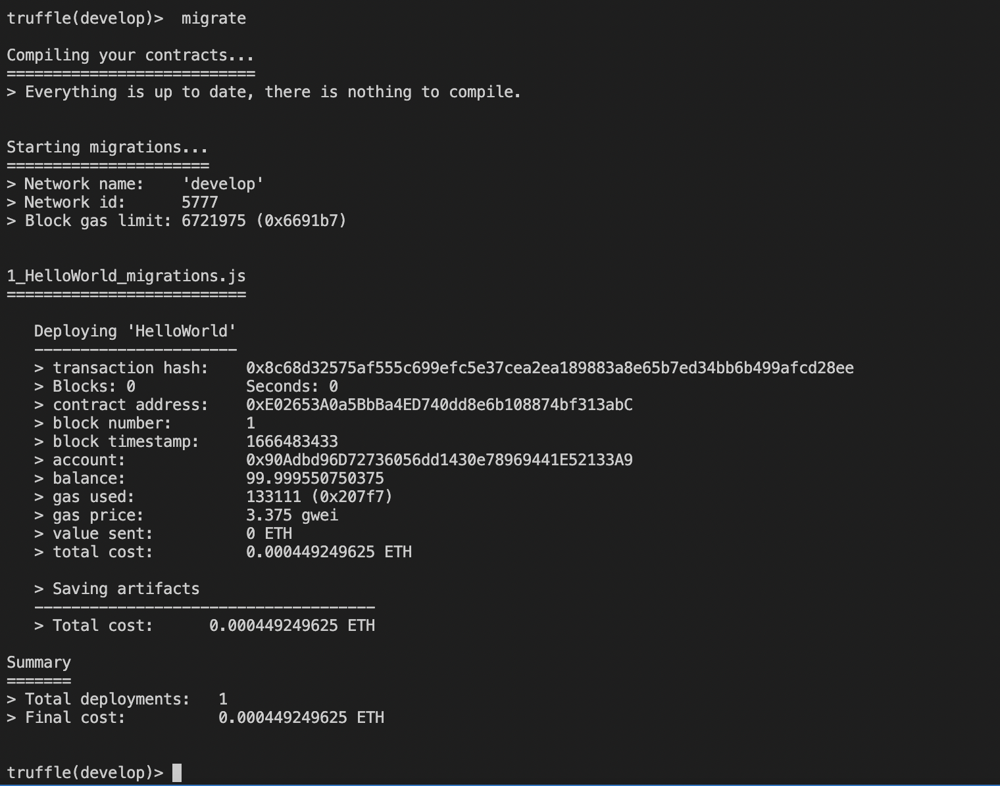
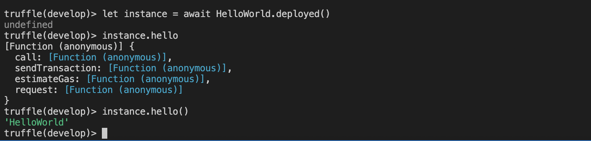
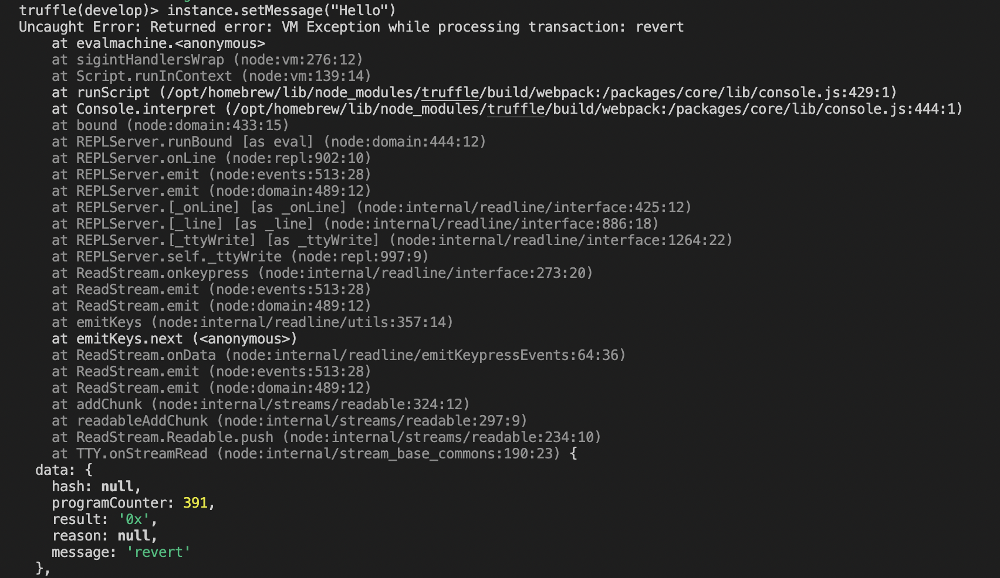
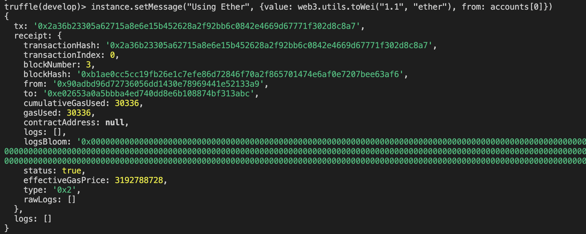
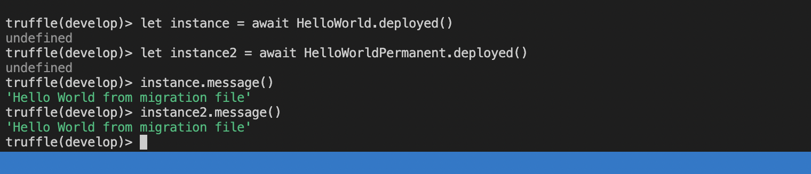
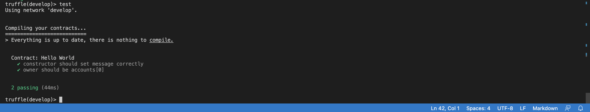

# Smart-contract-truffle
An implementation of smart contract using truffle

## Part 1/4

In this part, we learnt about creating a simple hello world smart contract 'sol; file. After that we created a migrations file. 
We learnt that the number infront of migration file specifies the order in which migration happens.
We migrated our hello world contract and then finally invoked it using the comandline.

### Running Migrations

### Calling the Contract

## Part 2/4

In this part we learnt how to use the constructors and setters to set the value of something after the deployment is done. Then we used the 'require'
method to ensure that we are using 1 ether for the transaction and also to ensure that only the owner is allowed to call the setter.

### Calling without ether and account

### Calling with ether and account 

Finally we created another helloWorld.sol file and used the .then() method in javascript to deploy the second hello world after the first hello world
deployment is complete. We also created an instance to the first hello world, and used the value of the message variable to set the value while deploying
the second hello world in migration file.

### Screenshot 

## Part 3/4

In this part we added test cases to our code and learnt how to unit test. We added two testcases, 1 to ensure that the 'constructor should set message correctly' and 'owner should be accounts[0]'

### Screenshot 

## Part 4/4

In this part we learnt about deployments to a testnet and mainnet